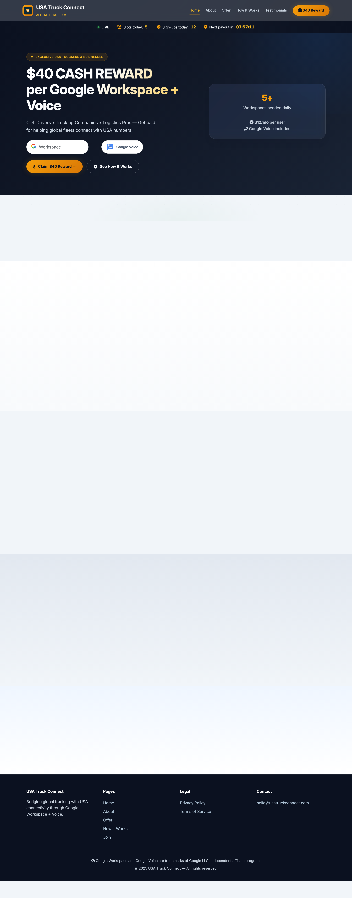
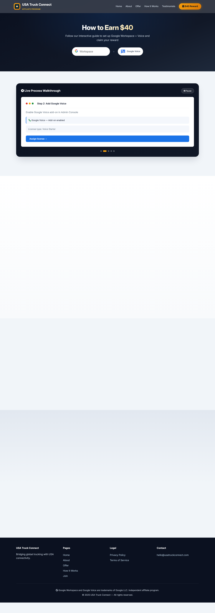
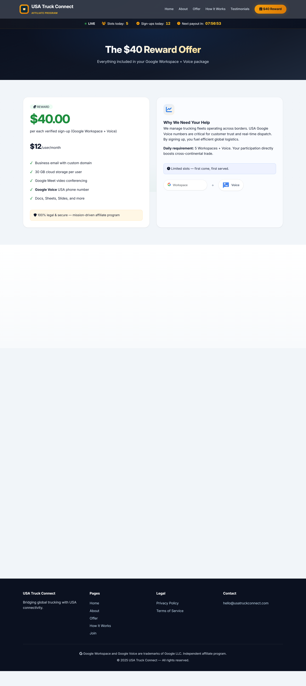
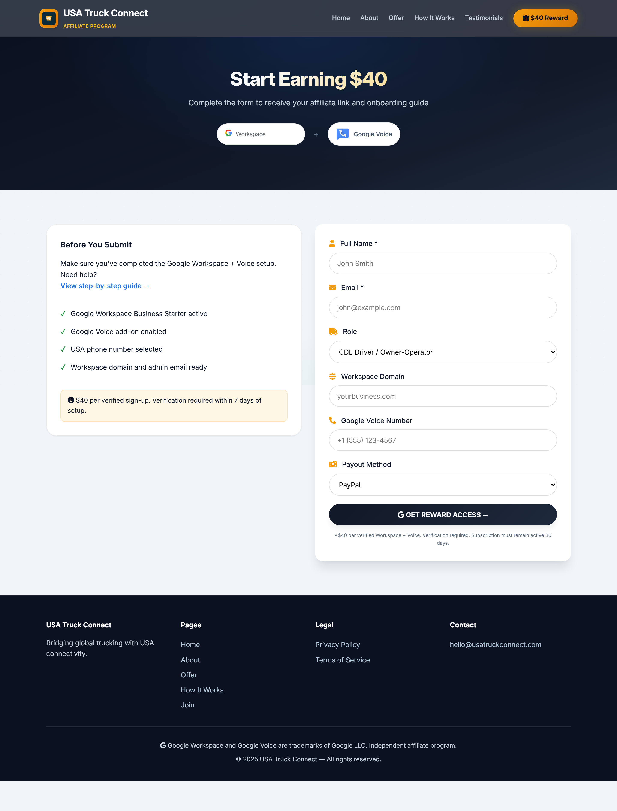
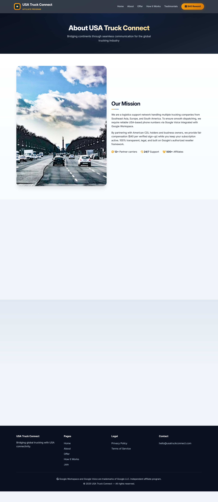
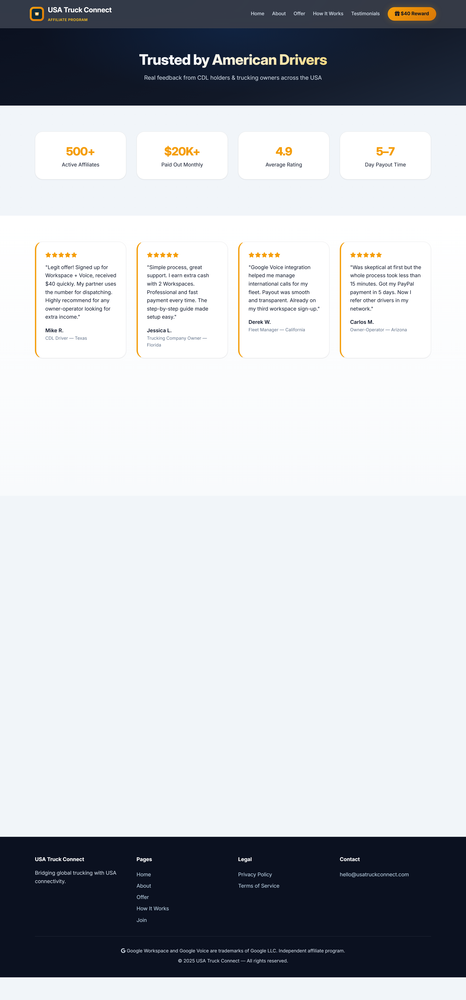

<div align="center">

# 🚛 USA Truck Connect

**Professional affiliate marketing website for Google Workspace + Google Voice sign-up rewards**

*Earn $40 per verified sign-up · Built for CDL drivers, trucking companies & USA businesses*

[](https://mafzalkalwardev.github.io/usa-truck-connect/)
[](https://developer.mozilla.org/en-US/docs/Web/HTML)
[](https://developer.mozilla.org/en-US/docs/Web/CSS)
[](https://developer.mozilla.org/en-US/docs/Web/JavaScript)
[](LICENSE)
[](CONTRIBUTING.md)

*Documented · MIT licensed · Maintained*

---

### Contribution graph


</div>

---

## 📖 Overview

A production-grade, multi-page static affiliate website that helps American CDL drivers and business owners earn **$40 cash rewards** for each verified **Google Workspace + Google Voice** sign-up. The site features live counters, scroll animations, an interactive 5-step setup wizard, and an auto-playing process walkthrough — all with zero backend required.

**Live demo:** [https://mafzalkalwardev.github.io/usa-truck-connect/](https://mafzalkalwardev.github.io/usa-truck-connect/)

---

## ✨ Features

| Feature | Description |
|---------|-------------|
| 🏠 **Multi-page architecture** | 9 pages: Home, About, Offer, How It Works, Testimonials, Join, Thank You, Privacy, Terms |
| 📊 **Live stats bar** | Real-time slots remaining, sign-ups today, payout countdown timer |
| 🧙 **Interactive wizard** | 5-step Google Workspace + Voice setup guide with progress tracking |
| 🎬 **Animated walkthrough** | Auto-playing mock UI demo of the full signup-to-payout flow |
| 🎨 **Professional design system** | Color theory–based palette, Google brand colors, glassmorphism, elevation shadows |
| 📱 **Fully responsive** | Mobile-first with sticky CTA bar, collapsible nav, touch-friendly forms |
| 📬 **FormSubmit.co integration** | Zero-backend affiliate lead capture with thank-you redirect |
| ♿ **Accessible** | Semantic HTML, ARIA labels, focus states, readable contrast ratios |
| 🌙 **Dark mode support** | Respects `prefers-color-scheme` for cards, forms, and surfaces |

---

## 📸 Screenshots

### Home — Hero, live stats & Google product logos



### How It Works — Interactive wizard & animated walkthrough



### Offer — $40 reward breakdown & FAQ accordion



### Join — Affiliate signup form



<details>
<summary>📷 More pages</summary>

| Page | Screenshot |
|------|------------|
| About |  |
| Testimonials |  |

</details>

---

## 🗂️ Site Structure

```
├── index.html              # Home — hero, live counters, trust badges
├── about.html              # Mission, compliance, partner stats
├── offer.html              # $40 reward, pricing, FAQ
├── how-it-works.html       # Wizard + walkthrough (core conversion page)
├── testimonials.html       # Social proof & case studies
├── join.html               # Affiliate signup form
├── thank-you.html          # Post-submit confirmation
├── privacy.html            # Privacy policy
├── terms.html              # Terms of service
├── css/main.css            # Design system & component styles
├── js/
│   ├── main.js             # Nav, FAQ accordion, AOS init
│   ├── counters.js         # Live stats simulation
│   ├── wizard.js           # Interactive setup wizard
│   └── animations.js       # Walkthrough auto-play
└── assets/logos/           # Official Google Voice PNG + Workspace SVG
```

---

## 🎨 Design System

Built with **split-complementary color theory** — cool slate surfaces (`#0B1120` → `#1E293B`) paired with warm gold accents (`#F59E0B`) and official Google brand colors:

| Token | Value | Usage |
|-------|-------|-------|
| `--google-blue` | `#1A73E8` | Links, wizard active states |
| `--google-green` | `#1E8E3E` | Success, Voice, payouts |
| `--accent-400` | `#F59E0B` | CTAs, highlights, stats |
| `--surface-900` | `#0B1120` | Navbar, hero, footer |

Typography: **Inter** (Google Fonts) · Animations: **AOS** · Icons: **Font Awesome 6**

---

## 🚀 Quick Start

```bash
# Clone
git clone https://github.com/mafzalkalwardev/usa-truck-connect.git
cd usa-truck-connect

# Serve locally
npx serve .
# → http://localhost:3000

# Capture screenshots (optional)
npm install
npm run screenshots
```

---

## 🌐 Deployment

### GitHub Pages (current)

Site deploys automatically from `main` branch:

1. Push to `main`
2. GitHub Pages serves from root
3. Live at: **https://mafzalkalwardev.github.io/usa-truck-connect/**

### Custom domain

Add a `CNAME` file with your domain and configure DNS:

```
CNAME  www  mafzalkalwardev.github.io
```

---

## 📦 Releases

See [Releases](https://github.com/mafzalkalwardev/usa-truck-connect/releases) for versioned snapshots of the site.

| Version | Date | Highlights |
|---------|------|------------|
| [v1.0.0](https://github.com/mafzalkalwardev/usa-truck-connect/releases/tag/v1.0.0) | Jun 2025 | Initial release — 9 pages, wizard, live counters, GitHub Pages |

---

## 📋 Form Handling

Signup form posts to [FormSubmit.co](https://formsubmit.co) — no server required.

| Field | Purpose |
|-------|---------|
| Full Name, Email | Contact & onboarding |
| Workspace Domain | Verification |
| Voice Number | USA phone confirmation |
| Payout Method | PayPal / Venmo / ACH |

Redirect after submit: `thank-you.html`

---

## 🤝 Contributing

Contributions welcome! See [CONTRIBUTING.md](CONTRIBUTING.md) and [CODE_OF_CONDUCT.md](CODE_OF_CONDUCT.md).

---

## ⚖️ Legal

Google Workspace and Google Voice are trademarks of **Google LLC**. USA Truck Connect is an **independent affiliate program** — not affiliated with, endorsed by, or sponsored by Google.

See [Privacy Policy](privacy.html) · [Terms of Service](terms.html) · [Security Policy](SECURITY.md)

---

## 📬 Contact

**Email:** [hello@usatruckconnect.com](mailto:hello@usatruckconnect.com)

---

<div align="center">

© 2025 USA Truck Connect — Bridging global trucking with USA connectivity

</div>
